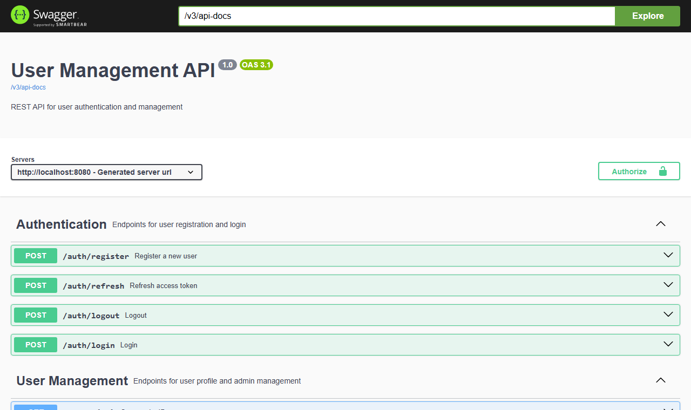
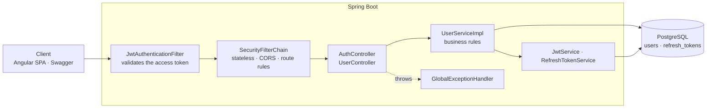
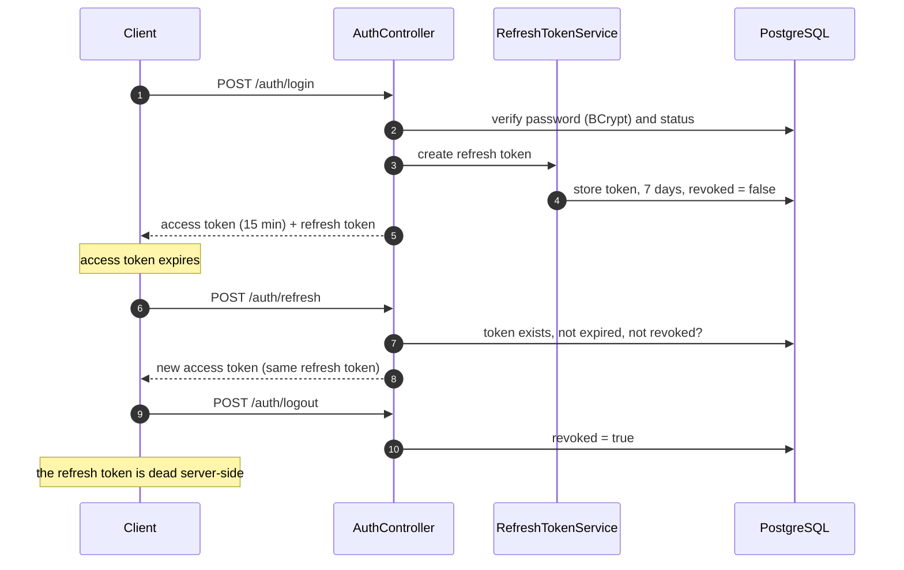
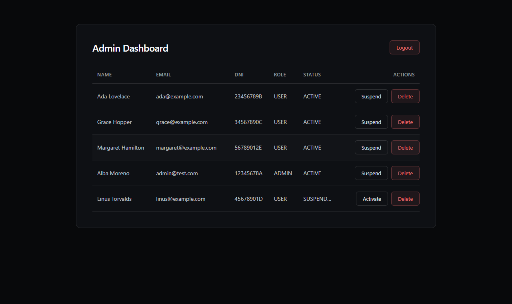

# User Management API

[](https://github.com/bakaruu/user-management-api/actions/workflows/ci.yml)

**A stateless authentication and user management REST API: 15-minute JWT access tokens, revocable refresh tokens
stored in the database, role-based access control, and a security layer that never lets a client hand itself more
privileges than it was given.**

[Live API](https://api.bakaru.dev/swagger-ui.html) · [Live frontend](https://app.bakaru.dev) ·
[Case study](https://www.bakaru.dev/projects/user-management) ·
[Angular client](https://github.com/bakaruu/user-management-frontend)



## What it does

- **Registers and authenticates users** with BCrypt-hashed passwords and validated input, including the Spanish DNI
  format. Email and DNI are unique in the database, not only in code.
- **Issues two tokens**: a short-lived signed access token (15 minutes) that carries the identity, and a refresh
  token (7 days) that lives in PostgreSQL and can be revoked, so logging out really ends a session.
- **Separates roles**: `USER` manages its own profile; `ADMIN` lists, updates, suspends and deletes users. Registration
  always creates a `USER`, so there is no privilege escalation path through the API.
- **Suspends accounts**: a `SUSPENDED` user cannot log in, and the account survives for auditing instead of being
  deleted.
- **Answers errors in one shape**, with field-level detail for validation failures, from a single exception handler.
- **Documents itself** with OpenAPI 3.1 and Swagger UI, and ships as a Docker image behind the same Angular client
  that uses it in production.

## Architecture



Layers stay in their lane: controllers only translate HTTP, `UserServiceImpl` owns the rules (who may suspend whom,
what a duplicate email means), and the security package owns tokens. Flyway migrations define the schema, and JPA
runs with `ddl-auto: validate`, so the database is never changed by accident at startup.

### The token lifecycle



## Security decisions

| Decision | Why |
|---|---|
| Access token of 15 minutes, refresh token of 7 days | A stolen access token is useless quickly; the long-lived half can be revoked because it lives in the database |
| Refresh tokens in PostgreSQL with a `revoked` flag | Stateless JWTs alone cannot be taken back; logout would be a client-side lie |
| `POST /auth/register` always creates a `USER` | No request body can grant itself `ADMIN`; the first admin is seeded directly in the database |
| Admin accounts cannot be suspended or deleted | Prevents locking every administrator out of the system (`403`) |
| A suspended account is refused at login with `401` | The account stays in the database for auditing instead of being deleted; the message states it is suspended, which is a deliberate trade of a little enumeration risk for a usable error |
| A new password must differ from the current one (`403`) | An "update" that silently changes nothing is a bug report waiting to happen |
| JWT secret validated at startup | An HS256 key shorter than 256 bits fails fast instead of silently weakening every token |
| `SessionCreationPolicy.STATELESS`, CSRF disabled | There is no session cookie to forge; the token travels in the `Authorization` header |
| Unique constraints on email and DNI | Two simultaneous registrations cannot both succeed |
| Errors always have the same shape | Clients parse one format; validation errors add a field-level `errors` map |

## The Angular client

The [frontend](https://github.com/bakaruu/user-management-frontend) consumes this API: route guards per role, a
silent token refresh when a request comes back `401`, and the admin panel below.



## Tech stack

Java 21, Spring Boot 3.5, Spring Security with JWT, Spring Data JPA and Hibernate, PostgreSQL 16, Flyway, SpringDoc
OpenAPI, Lombok, JUnit 5, Mockito, MockMvc, Docker and GitHub Actions.

## Run locally

Requirements: Docker and JDK 21.

**1. Environment variables.** Create a `.env` in the project root (it is git-ignored):

```env
DB_USERNAME=postgres
DB_PASSWORD=postgres
JWT_SECRET=change-this-to-a-random-string-of-at-least-32-characters
```

**2. Database.**

```bash
docker compose up -d
```

**3. Application.**

```bash
SPRING_PROFILES_ACTIVE=dev ./mvnw spring-boot:run
```

Swagger UI is at <http://localhost:8080/swagger-ui.html>. Flyway creates the schema on the first run.

**4. First admin.** Registration always creates a `USER`, so promote one account once, directly in the database:

```bash
docker exec user_management_db psql -U postgres -d user_management_db \
  -c "UPDATE users SET role='ADMIN' WHERE email='admin@test.com';"
```

## API reference

All request and response bodies are JSON. Endpoints under **User** and **Admin** require:

```
Authorization: Bearer <access_token>
```

### Public

#### `POST /auth/register`
Registers a new user with the `USER` role.

Request:
```json
{
  "firstName": "Ada",
  "lastName": "Lovelace",
  "dni": "12345678A",
  "email": "ada@example.com",
  "password": "password123"
}
```
> `dni` must match the Spanish format: 8 digits followed by a letter.

Response `201 Created`:
```json
{
  "token": "eyJhbGciOiJIUzI1NiJ9...",
  "refreshToken": "N3l1c2VyLXJlZnJlc2gtdG9rZW4...",
  "role": "USER",
  "user": {
    "id": "b3f1c2a0-...",
    "firstName": "Ada",
    "lastName": "Lovelace",
    "dni": "12345678A",
    "email": "ada@example.com",
    "role": "USER",
    "status": "ACTIVE",
    "createdAt": "2026-09-11T10:00:00",
    "updatedAt": "2026-09-11T10:00:00"
  }
}
```
`409 Conflict` if the email or DNI is already registered.

#### `POST /auth/login`
```json
{ "email": "ada@example.com", "password": "password123" }
```
Response `200 OK`: same shape as `/auth/register`. `401 Unauthorized` for wrong credentials or a suspended account.

#### `POST /auth/refresh`
Exchanges a valid refresh token for a new 15-minute access token.

```json
{ "refreshToken": "N3l1c2VyLXJlZnJlc2gtdG9rZW4..." }
```
Response `200 OK`: same shape as `/auth/register`; the refresh token comes back unchanged. `401 Unauthorized` if it
is invalid, expired or revoked.

#### `POST /auth/logout`
Revokes the given refresh token server-side.

```json
{ "refreshToken": "N3l1c2VyLXJlZnJlc2gtdG9rZW4..." }
```
Response: `204 No Content`.

### User

| Method | Endpoint | Description |
|--------|----------|-------------|
| `GET` | `/users/me` | The authenticated user's profile |
| `PUT` | `/users/me` | Update own data; every field is optional and only the ones sent change |

`PUT /users/me` request and response:
```json
{ "firstName": "Ada", "email": "ada.new@example.com" }
```

### Admin

*Requires the `ADMIN` role.*

| Method | Endpoint | Description |
|--------|----------|-------------|
| `GET` | `/users` | List all users |
| `GET` | `/users/{id}` | Get a user by ID |
| `PUT` | `/users/{id}` | Update any user (same body as `PUT /users/me`) |
| `PATCH` | `/users/{id}/status` | Suspend or activate a user |
| `DELETE` | `/users/{id}` | Delete a user |

`GET`, `PUT` and `DELETE` on `/users/{id}` return `404 Not Found` for an unknown user. Admin accounts cannot be
suspended or deleted (`403 Forbidden`).

`PATCH /users/{id}/status` takes `{ "status": "SUSPENDED" }` or `"ACTIVE"` and answers `204 No Content`.

### Errors

Every error has the same shape:

```json
{
  "status": 400,
  "message": "Validation failed",
  "errors": {
    "email": "Email must be valid"
  }
}
```

`errors` appears only for field-level validation failures (`400`); `401`, `403`, `404` and `409` omit it.

## Tests

```bash
./mvnw test
```

Unit tests with Mockito for the service-layer rules, and `@SpringBootTest` + MockMvc integration tests that go
through the real security filter chain, covering authenticated and unauthenticated paths. CI runs `./mvnw verify` on
every push and pull request to `main`.

## License

MIT — see [LICENSE](LICENSE).
